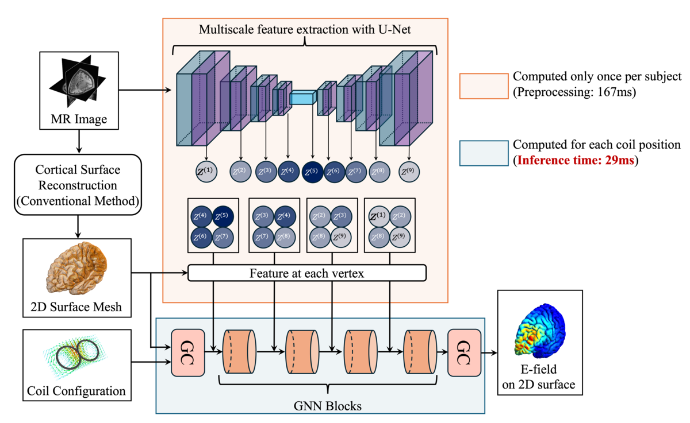
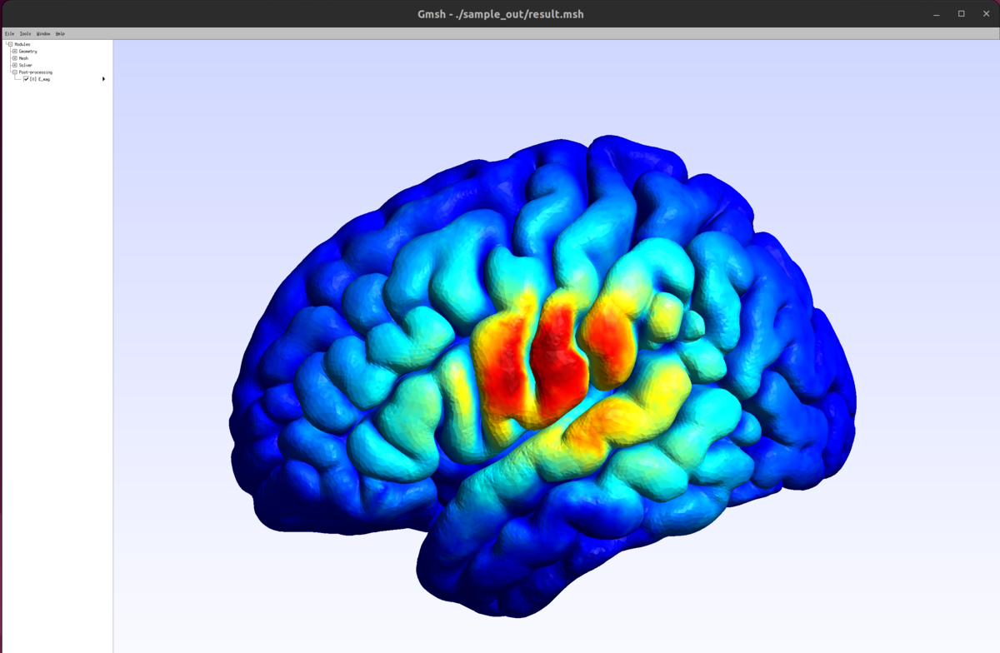

# Cortical Surface Electric Field Estimation for Real-Time TMS with Graph Neural Networks

## Method Overview

<p align="center">
  
</p>

We propose a deep learning framework for real-time estimation of the TMS-induced electric field on the cortical surface.
The proposed model consists of a U-Net and a graph neural network (GNN):

- **Input:** MR image and coil configuration
- **Feature extraction:** U-Net extracts multiscale features from the MR image
- **Graph modeling:** cortical surface mesh is treated as a graph
- **Prediction:** GNN estimates the three-dimensional vector (electric field) at each mesh vertex


## Description

This repository provides the implementation of:

**Cortical Surface Electric Field Estimation for Real-Time TMS with Graph Neural Networks**, T. Maki et al., *Physics in Medicine & Biology*, 2025.

Paper: https://doi.org/10.1088/1361-6560/ae1ee7

The MR images used in this study are publicly available from the Human Connectome Project (HCP):

https://www.humanconnectome.org/study/hcp-young-adult

## Sample Inference Demo

To test the model pipeline without preparing any MRI or mesh data, you can run a simple demo using publicly available anatomical templates.
We provide a sample script that loads the sample T1-weighted brain image and performs E-field inference on a cortical mesh with a sample coil configuration.

### Tested Environment

- OS: Ubuntu 22.04 LTS
- Python: 3.10
- Pytorch: 2.5
- CUDA: 12.6


### Requirements

```bash
mamba env create -f requirements.yml
conda activate sample
```

### Run the demo
```shell
python demo_infer.py
```

### Visualization
```shell
gmsh ./sample_out/result.msh
```

- Output Example

<p align="center">
  
</p>

## Citation
```bibtex
@article{maki2025cortical,
  title={Cortical surface electric field estimation for real-time TMS with graph neural networks},
  author={Maki, Toyohiro and Yokota, Tatsuya and Hirata, Akimasa and Hontani, Hidekata},
  journal={Physics in Medicine \& Biology},
  volume={70},
  number={23},
  pages={235010},
  year={2025},
  publisher={IOP Publishing}
}
```
